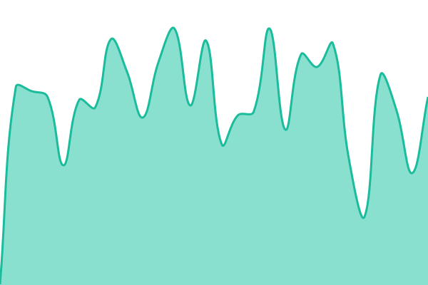
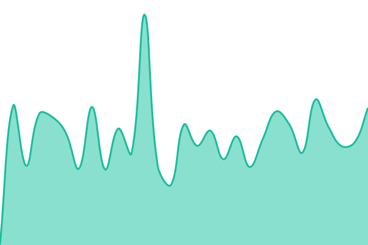
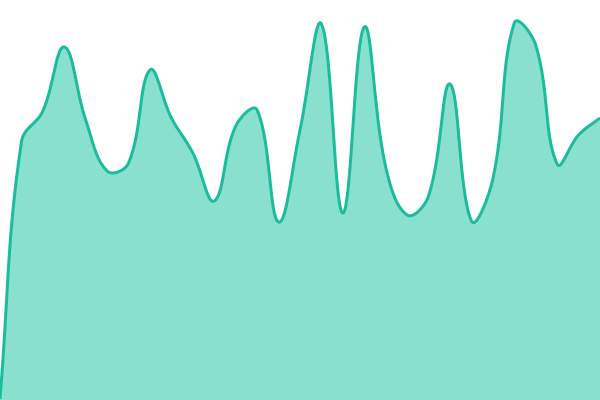
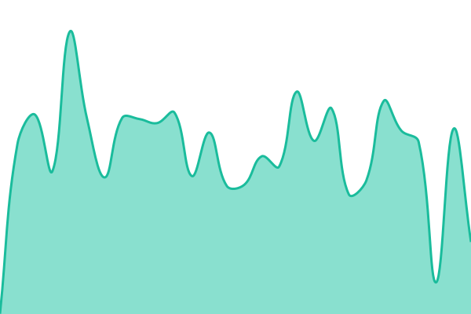
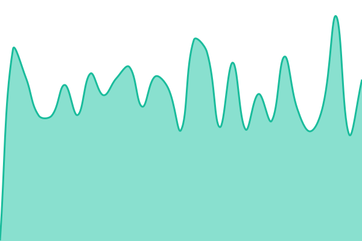
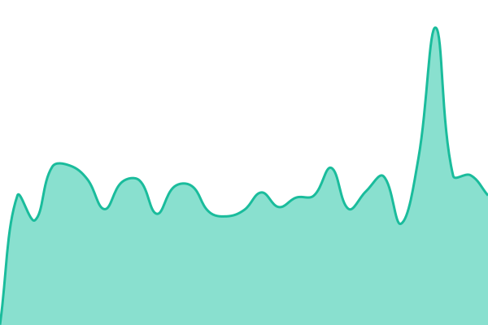

# [📈 Live Status](https://funkysi1701.github.io/uptime/): <!--live status--> **🟩 All systems operational**

This repository contains the open-source uptime monitor and status page for [Upptime](https://upptime.js.org), powered by [Upptime](https://github.com/upptime/upptime).

With [Upptime](https://upptime.js.org), you can get your own unlimited and free uptime monitor and status page, powered entirely by a GitHub repository. We use [Issues](https://github.com/upptime/upptime/issues) as incident reports, [Actions](https://github.com/funkysi1701/uptime/actions) as uptime monitors, and [Pages](https://funkysi1701.github.io/uptime/) for the status page.

<!--start: status pages-->
<!-- This summary is generated by Upptime (https://github.com/upptime/upptime) -->
<!-- Do not edit this manually, your changes will be overwritten -->
<!-- prettier-ignore -->
| URL | Status | History | Response Time | Uptime |
| --- | ------ | ------- | ------------- | ------ |
|  [www.funkysi1701.com](https://www.funkysi1701.com) | 🟩 Up | [www-funkysi1701-com.yml](https://github.com/funkysi1701/uptime/commits/HEAD/history/www-funkysi1701-com.yml) | 

 274ms
     
 | 

<a href="https://status.funkysi1701.com/history/www-funkysi1701-com">100.00%</a>
    

|  [mandelbrot.funkysi1701.com](https://mandelbrot.funkysi1701.com) | 🟩 Up | [mandelbrot-funkysi1701-com.yml](https://github.com/funkysi1701/uptime/commits/HEAD/history/mandelbrot-funkysi1701-com.yml) | 

 318ms
     
 | 

<a href="https://status.funkysi1701.com/history/mandelbrot-funkysi1701-com">100.00%</a>
    

|  [www.episodeatlas.com](https://www.episodeatlas.com) | 🟩 Up | [www-episodeatlas-com.yml](https://github.com/funkysi1701/uptime/commits/HEAD/history/www-episodeatlas-com.yml) | 

 296ms
     
 | 

<a href="https://status.funkysi1701.com/history/www-episodeatlas-com">100.00%</a>
    

|  [signaldiff.dev](https://signaldiff.dev) | 🟩 Up | [signaldiff-dev.yml](https://github.com/funkysi1701/uptime/commits/HEAD/history/signaldiff-dev.yml) | 

 638ms
     
 | 

<a href="https://status.funkysi1701.com/history/signaldiff-dev">100.00%</a>
    

|  [www.thornepentecostalchurch.co.uk](https://www.thornepentecostalchurch.co.uk) | 🟩 Up | [www-thornepentecostalchurch-co-uk.yml](https://github.com/funkysi1701/uptime/commits/HEAD/history/www-thornepentecostalchurch-co-uk.yml) | 

 383ms
     
 | 

<a href="https://status.funkysi1701.com/history/www-thornepentecostalchurch-co-uk">100.00%</a>
    

|  [certification.funkysi1701.com](https://certification.funkysi1701.com) | 🟩 Up | [certification-funkysi1701-com.yml](https://github.com/funkysi1701/uptime/commits/HEAD/history/certification-funkysi1701-com.yml) | 

 287ms
     
 | 

<a href="https://status.funkysi1701.com/history/certification-funkysi1701-com">100.00%</a>
    

|  [search.funkysi1701.com](https://search.funkysi1701.com) | 🟩 Up | [search-funkysi1701-com.yml](https://github.com/funkysi1701/uptime/commits/HEAD/history/search-funkysi1701-com.yml) | 

 686ms
     
 | 

<a href="https://status.funkysi1701.com/history/search-funkysi1701-com">100.00%</a>
    

|  [Azure Function](https://azurefunction-d4bkcjdahseefphm.uksouth-01.azurewebsites.net) | 🟩 Up | [azure-function.yml](https://github.com/funkysi1701/uptime/commits/HEAD/history/azure-function.yml) | 

 1523ms
     
 | 

<a href="https://status.funkysi1701.com/history/azure-function">100.00%</a>
    

<!--end: status pages-->

[**Visit our status website →**](https://funkysi1701.github.io/uptime/)

## 📄 License

- Powered by: [Upptime](https://github.com/upptime/upptime)
- Code: [MIT](./LICENSE) © [Anand Chowdhary](https://anandchowdhary.com), supported by [Pabio](https://pabio.com)
- Data in the `./history` directory: [Open Database License](https://opendatacommons.org/licenses/odbl/1-0/)
